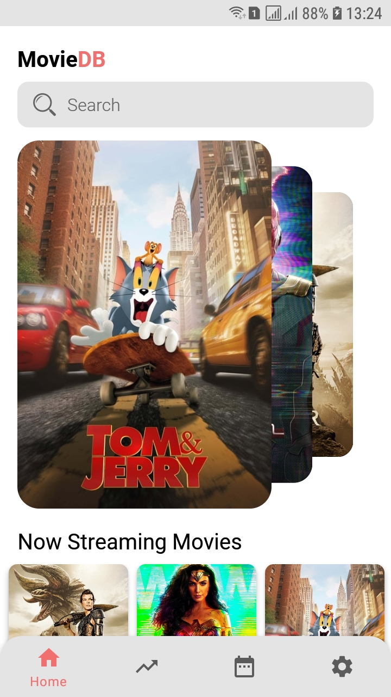
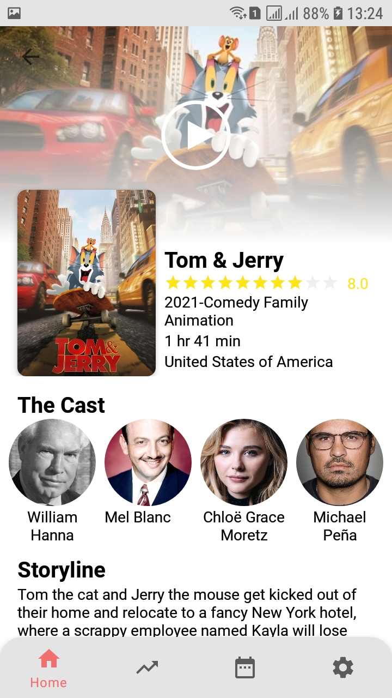
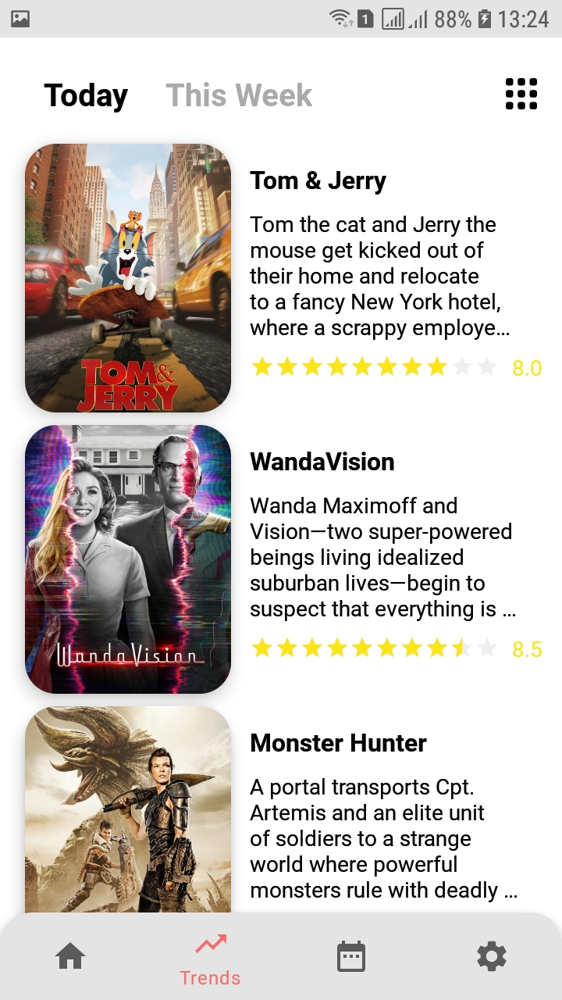
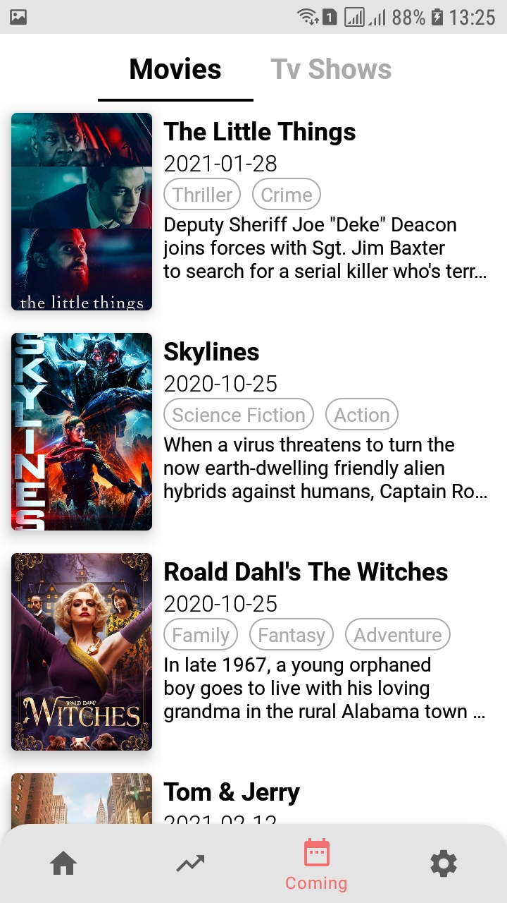
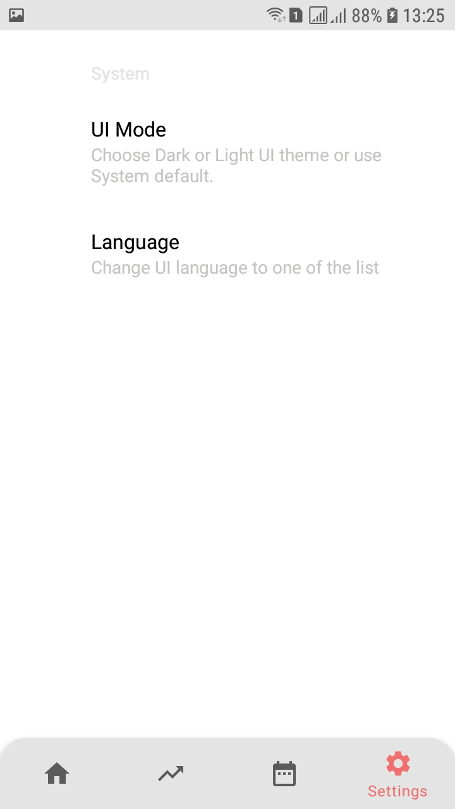
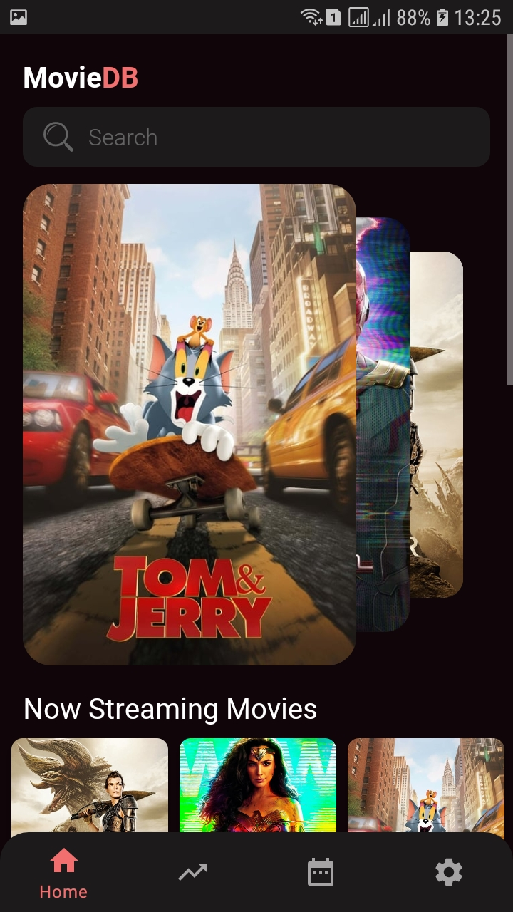
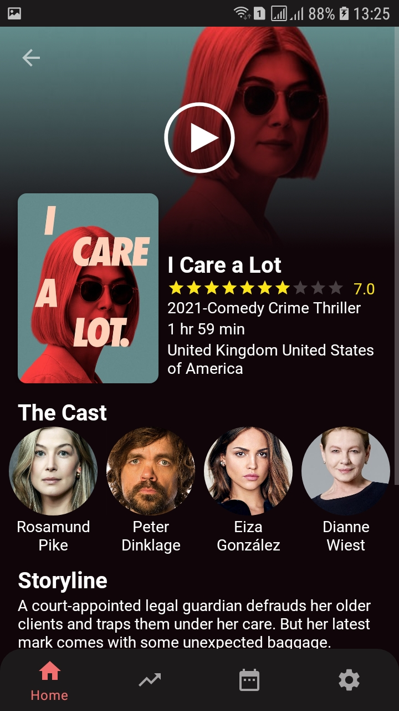
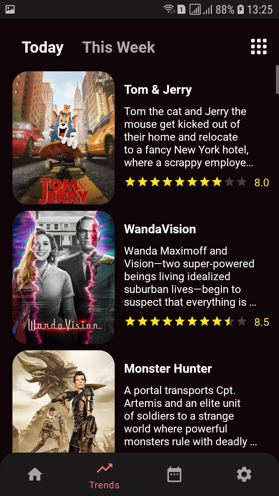

# New MovieApp
</img>
</img>
</img>
</img>
</img>
</img>
</img>
</img>

## Base project
- **MVVM + MVI Architecture**
- **Support Dark/Light Theme**
- **Dependency injection with Dagger 2**
- **Paging 3**
- **Kotlin Coroutines**
- **Kotlin StateFlow and SharedFlow**
- **Room**
- **Retrofit**

## Quick start
1. Create MovieDb DEVELOPER ACCOUNT and get Your `API KEY` in https://developers.themoviedb.org/3/
2. Clone repository
3. In root of project create file "secret.properties" with `API_KEY=XXX`
4. Run application and enjoy